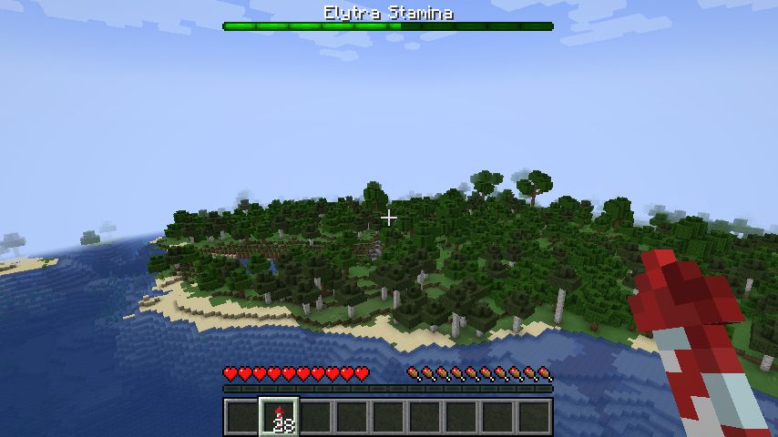

Do you also dream of connecting your worlds with all kinds of travel only to find out people rush for the elytras, and never look back.

Instead of removing them, let give them a gentle nerf. They will still be very useful for quick escape or navigating your bases, but this plugin makes long travel with the elytra much less viable.

It works by having a staminameter. When you fly it slowly trickles down, and when you're out of stamina you will drop similar to an elytra breaking, but since it's per player it will not help to swap to a different elytra.

Additionally using a rocket will cost extra stamina, and with the default values it takes a minute of gliding to fully deplete, and a little over 3minutes to fully recover.

All the values are configurable.
